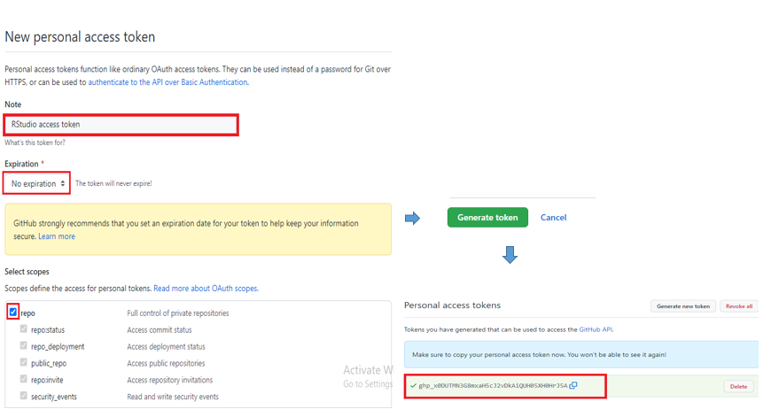
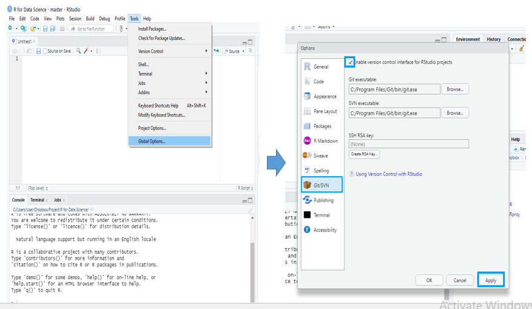
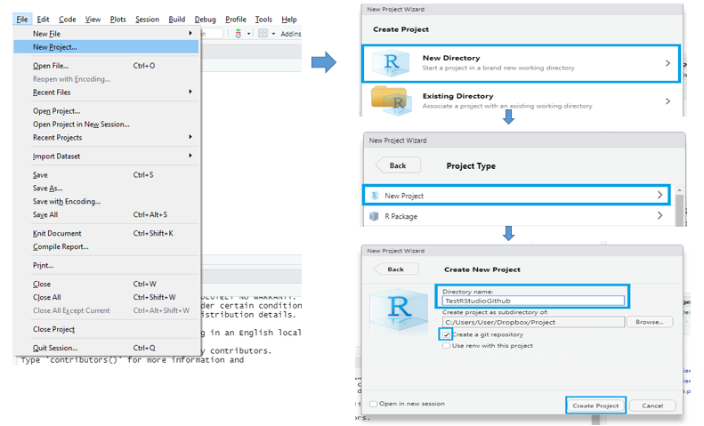
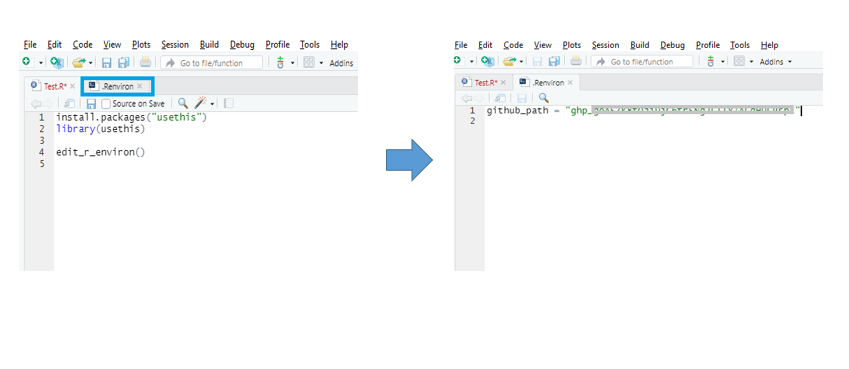
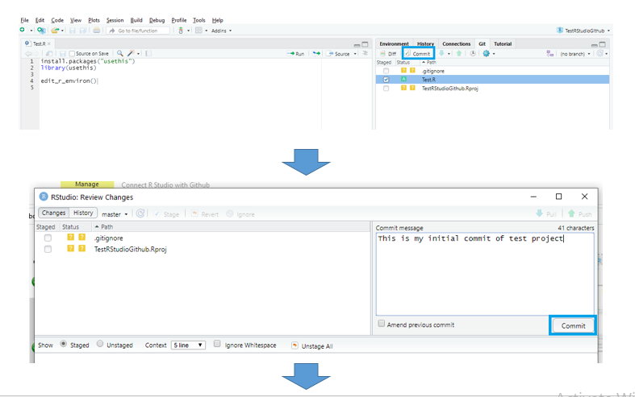
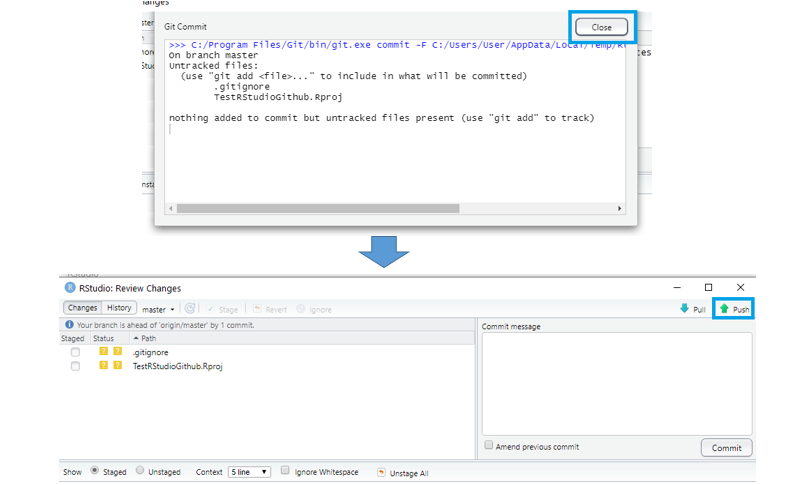
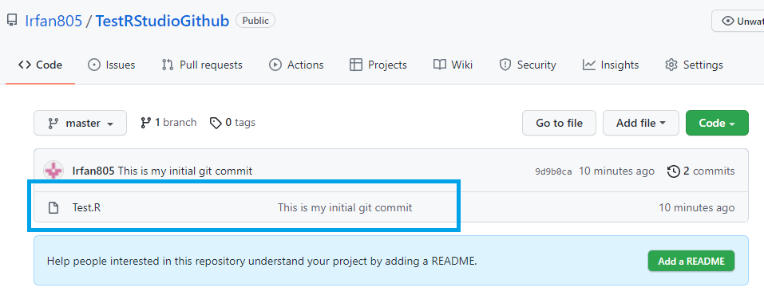

# How to connect RStudio with Github?
Here, we'll discuss the process to connect your desktop RStudio with Github, so that you can manage all your R codes in global/remote from your local machine.
You all are pretty familiar with Github. So, I'll not discuss about Git or Github here, if you want to know details, you can [follow tutorials](https://www.youtube.com/watch?v=SWYqp7iY_Tc) and do some reasearch online.

You need to have three items available to get this service
* R and RStudio in your desktop (Download [R](https://cran.r-project.org/bin/windows/base/), [RStudio](https://www.rstudio.com/products/rstudio/download/) and install it)
* Git in your desktop (Download [Git](https://git-scm.com/downloads), and install it)
* A [Github](https://github.com/) account

Once you are done with all of those three items, you can proceed to your local work to global/remote.

## Step One: Authentication
You need to take a authentication token to get access to Github from you local RStudio. You need to sign in your Github account and follow the corresponding steps-

**[Github](https://github.com/) account** > **Settings** > **Developer settings** > **Personal access tokens** > **Generate new token** > **Add note, select expiration, tick repo section** > **Generate token**

**Note: Don't forget to copy & save the access token to a notepad.** Because once you refresh your browser, you won't get the code again.

## Step two: Setup RStudio
#### Check RStudio
Once you have the access token, now it's time to setup your RStudio. Before you start for the setup, you need to check that you RStudio is enable for version contron interface for projects or not. Follow the corresponding steps to check this.

**RStudio** > **Tools** > **Global Options** > **Git/SVN** > **Tick** Enable version control interface for RStudio projects > **Apply**

#### Create a project
You need to create a project that you want to work with and store it to Github. In this step, you need to go with this following steps-

**RStudio** > **File** > **New Project** > **New Directory** > **New Project** > Put a **Directory name** & **tick on** Create a git repository > **Create Project**

#### Edit environment and start your project
In the previous step we've created the project. Now, it's time to start the project with our project task. Let's create a R script, say **Test.R** and install the library **usethis**. So, we need to run the below codes in the console or in your script

`install.packages("usethis")`

`library(usethis)`

`edit_r_environ()`

Once use run this code you'll notice that, there is new script opened autimatically named *".Renviron"*. You need to paste you access token(get in step 1) here with a object name, 
say **github_path = "au%%%%%%%%%%%%%%%%%%%"**.

Save the *".Renviron"* script and close it.

**Note:** You need to restart you R session to implement the effect of your access token. You can do oit with the following steps-

**RStudio** > **Session** > **Restart R**

Now using the library *"usethis"* you can connect your project with github just running this code in your console

`
use_github(protocol = 'https', auth_token = Sys.getenv("github_path"))
`

In you R console you will notice that R is asking for your confirmation, you will enter the number with *Yes/Yeah*, (Probably it's 1). After your confirmation it'll take you to the Github repository in your browser.

**Congrats**, with this step your RStudio is connected with you Github account.

## Step three: Push project to Github
Now, you may want to push your project/task of RStudio in Github. For this, you need to save the script of your project, in our case it's *Test.R*. Then We'll find a ***Git*** tab on top right. You need to select the file(*Test.R*) you want to push. Then follow these steps

**Select the R script** > **Commit**

You will get a new wingdow when you click commit, there you can put some text for you own and then click **commit** again. You'll get a message window and close it.

Once you click commit then your R script has updated to stage and to push it to Github you need to click **push**, You'll get another message window and close it.

After pushing it, you closee the message and commit window. Now, if you go to the browser in you github account you can see that your local file will appear in your github account.

***Congratulations!!!***, **Your local RStudio project is finally on Github**
